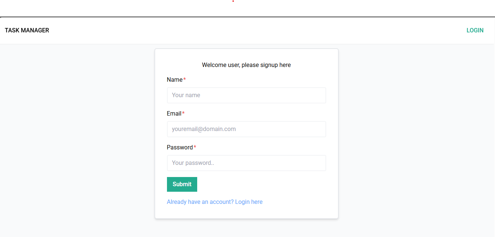
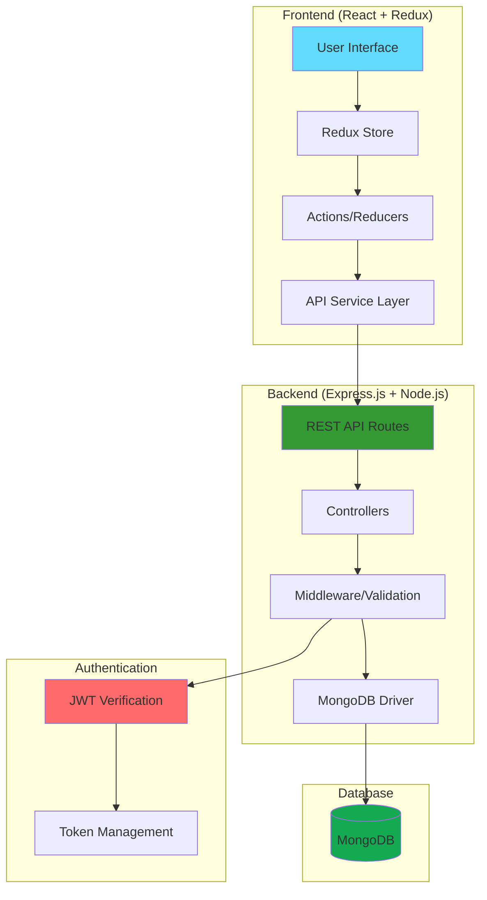
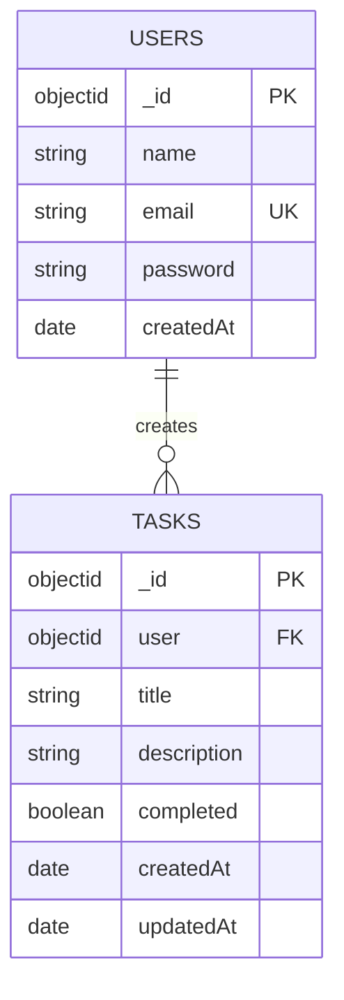
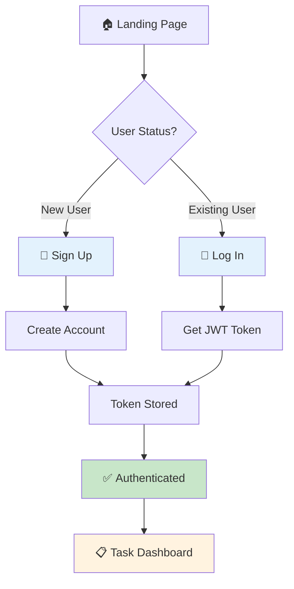
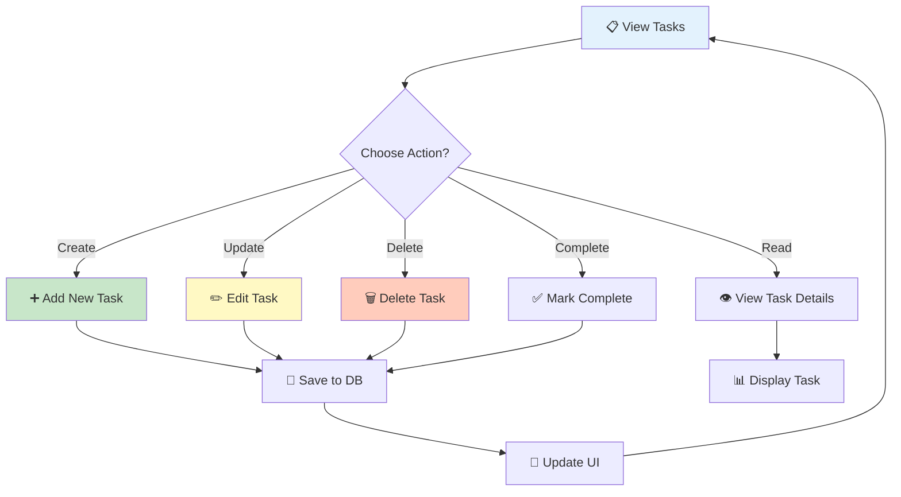
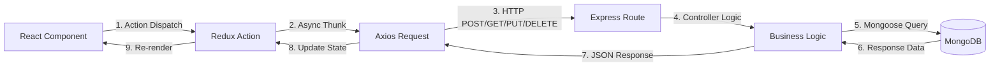

# 📋 Zidio Task Manager
### *A Modern Full-Stack Task Management Platform*

[](https://reactjs.org/)
[](https://nodejs.org/)
[](https://www.mongodb.com/)
[](https://tailwindcss.com/)
[](https://redux.js.org/)

> **🎯 A full-stack web application for efficient task management with JWT authentication, real-time updates, and beautiful UI built with Tailwind CSS.**

---

## 📋 Table of Contents

- [Overview](#overview)
- [Features](#features)
- [Architecture](#architecture)
- [Database Schema](#database-schema)
- [API Endpoints](#api-endpoints)
- [Tech Stack](#tech-stack)
- [Installation & Setup](#installation--setup)
- [Project Structure](#project-structure)
- [User Flows](#user-flows)
- [Security](#security--validation)
- [Testing](#testing)
- [Troubleshooting](#troubleshooting)
- [Contact](#contact)

---

## 🎬 Screenshots

### Authentication
| Signup Page |
|:---:|
|  |
| Create a new account with name, email, and password |

### Task Management
| Write Task | Completed Tasks |
|:---:|:---:|
|  |  |
| Add and manage your tasks | View completed tasks with status indicators |

---

## Overview

Zidio Task Manager is a modern, full-stack MERN application designed for efficient task management. It features JWT-based authentication, RESTful API architecture, Redux state management, and a responsive UI built with Tailwind CSS. Perfect for learning MERN stack development or as a foundation for advanced task management systems.

---

## ✨ Features

### 🎯 Core Functionality
- **🔐 User Authentication** - Secure signup/login with JWT tokens
- **✍️ Task Management** - Create, read, update, and delete tasks
- **👤 User Profile** - View and manage user profile information
- **📱 Responsive Design** - Mobile-friendly interface with Tailwind CSS
- **🔄 Real-time UI Updates** - Instant feedback on task operations

### ⚡ Advanced Features
- **🛡️ JWT Token Protection** - Secure API endpoints with middleware
- **✅ Form Validation** - Both frontend and backend validation
- **📦 Redux State Management** - Centralized application state
- **🎨 Modern UI/UX** - Beautiful, responsive interface
- **🔑 Secure Password Hashing** - Bcrypt encryption for passwords
- **📊 Toast Notifications** - User feedback on actions

---

## 🏗️ Architecture Overview



---

## 🗄️ Database Schema

### Entity Relationship Diagram



### Collections Overview

**Users Collection**
```json
{
  "_id": ObjectId,
  "name": "John Doe",
  "email": "john@example.com",
  "password": "hashed_password_bcrypt",
  "createdAt": ISODate("2024-11-27")
}
```

**Tasks Collection**
```json
{
  "_id": ObjectId,
  "user": ObjectId,          // Reference to Users
  "title": "Complete project",
  "description": "Finish the MERN task manager",
  "completed": false,
  "createdAt": ISODate("2024-11-27"),
  "updatedAt": ISODate("2024-11-27")
}
```

### Database Relationships
- **User (1) ← → (N) Task** - One user can have many tasks
- **Foreign Key Constraint** - Tasks.user references Users._id

---

## 🔧 API Endpoints

### Authentication Endpoints
```http
POST   /api/auth/signup          # Register new user
POST   /api/auth/login           # Authenticate user and get token
GET    /api/profile              # Get current user profile (Protected)
PUT    /api/profile              # Update user profile (Protected)
```

### Task Management Endpoints
```http
GET    /api/tasks                # Get all tasks for authenticated user
POST   /api/tasks                # Create new task
GET    /api/tasks/:id            # Get specific task by ID
PUT    /api/tasks/:id            # Update task
DELETE /api/tasks/:id            # Delete task
```

### Request/Response Examples

**Login Request**
```bash
curl -X POST http://localhost:5000/api/auth/login \
  -H "Content-Type: application/json" \
  -d '{
    "email": "user@example.com",
    "password": "password123"
  }'
```

**Login Response**
```json
{
  "status": true,
  "msg": "Login successful..",
  "token": "eyJhbGciOiJIUzI1NiIsInR5cCI6IkpXVCJ9...",
  "user": {
    "_id": "507f1f77bcf86cd799439011",
    "name": "John Doe",
    "email": "john@example.com"
  }
}
```

**Create Task Request**
```bash
curl -X POST http://localhost:5000/api/tasks \
  -H "Content-Type: application/json" \
  -H "Authorization: Bearer YOUR_TOKEN" \
  -d '{
    "title": "Complete project",
    "description": "Finish the MERN task manager",
    "completed": false
  }'
```

**Create Task Response**
```json
{
  "status": true,
  "msg": "Task created successfully",
  "task": {
    "_id": "507f1f77bcf86cd799439012",
    "user": "507f1f77bcf86cd799439011",
    "title": "Complete project",
    "description": "Finish the MERN task manager",
    "completed": false,
    "createdAt": "2024-11-27T10:30:00Z"
  }
}
```

---

## 🚀 Tech Stack

### Frontend Technologies
| Technology | Version | Purpose |
|------------|---------|---------|
| **React** | 18.1.0 | UI library and component framework |
| **React Router** | 6.3.0 | Client-side routing and navigation |
| **Redux** | 4.2.0 | State management |
| **Redux Thunk** | 2.4.1 | Async action handling |
| **Axios** | 0.27.2 | HTTP client for API calls |
| **Tailwind CSS** | 3.3.0 | Utility-first CSS framework |
| **React Toastify** | 9.0.1 | Toast notifications |

### Backend Technologies
| Technology | Version | Purpose |
|------------|---------|---------|
| **Node.js** | 14+ | JavaScript runtime |
| **Express.js** | 4.17.3 | Web framework |
| **MongoDB** | 6.2 | NoSQL database |
| **Mongoose** | 6.2.3 | MongoDB ODM |
| **JWT** | 8.5.1 | JSON Web Token authentication |
| **Bcrypt** | 5.0.1 | Password hashing |
| **CORS** | 2.8.5 | Cross-Origin Resource Sharing |
| **Dotenv** | 16.0.0 | Environment variable management |

---

## 🛠️ Installation & Setup

### Prerequisites
- **Node.js 14+** - [Download](https://nodejs.org/)
- **MongoDB 5.0+** - [Download Community](https://www.mongodb.com/try/download/community)
- **npm or yarn** - Package manager
- **Git** - Version control

### Quick Start (Windows PowerShell)

#### Step 1: Clone Repository
```powershell
git clone https://github.com/RajitPRAJAPATI/Task_Management_System.git
cd ZidioTaskManger-main
```

#### Step 2: Install Dependencies
```powershell
# Install all dependencies (frontend + backend)
npm run install-all
```

#### Step 3: Setup Environment Variables
Create `backend/.env` file:
```env
# MongoDB Configuration
MONGODB_URL=mongodb://127.0.0.1:27017/taskmanager

# Server Configuration
PORT=5000
NODE_ENV=development

# JWT Configuration
ACCESS_TOKEN_SECRET=your_super_secret_key_change_this_in_production
JWT_EXPIRY=7d
```

#### Step 4: Start MongoDB
```powershell
# If MongoDB installed locally, start it:
mongod

# Or use MongoDB Atlas (cloud):
# Update MONGODB_URL in .env with your Atlas connection string
```

#### Step 5: Run the Application

**Option A - Run both simultaneously (Recommended)**
```powershell
cd C:\path\to\ZidioTaskManger-main
npm run dev
```
- Backend: `http://localhost:5000`
- Frontend: `http://localhost:3000`

**Option B - Run separately (for debugging)**

Terminal 1 - Backend:
```powershell
cd backend
npm run dev
```

Terminal 2 - Frontend:
```powershell
cd frontend
npm start
```

#### Step 6: Access the Application
Open your browser and navigate to:
```
http://localhost:3000
```

---

## 📁 Project Structure

```
ZidioTaskManger-main/
├── backend/                          # Express.js Backend
│   ├── controllers/
│   │   ├── authControllers.js       # Authentication logic
│   │   ├── taskControllers.js       # Task CRUD operations
│   │   └── profileControllers.js    # Profile management
│   ├── models/
│   │   ├── User.js                  # User schema
│   │   └── Task.js                  # Task schema
│   ├── routes/
│   │   ├── authRoutes.js            # Auth endpoints
│   │   ├── taskRoutes.js            # Task endpoints
│   │   └── profileRoutes.js         # Profile endpoints
│   ├── utils/
│   │   ├── token.js                 # JWT token creation
│   │   └── validation.js            # Input validation
│   ├── middlewares/
│   │   └── index.js                 # Authentication middleware
│   ├── app.js                       # Express app setup
│   ├── package.json                 # Backend dependencies
│   └── .env                         # Environment variables
│
├── frontend/                         # React Frontend
│   ├── src/
│   │   ├── components/
│   │   │   ├── LoginForm.jsx        # Login component
│   │   │   ├── SignupForm.jsx       # Signup component
│   │   │   ├── Tasks.jsx            # Tasks display
│   │   │   ├── Navbar.jsx           # Navigation bar
│   │   │   └── utils/
│   │   │       ├── Input.jsx        # Reusable input
│   │   │       ├── Loader.jsx       # Loading spinner
│   │   │       └── Tooltip.jsx      # Tooltip component
│   │   ├── pages/
│   │   │   ├── Home.jsx             # Home page
│   │   │   ├── Login.jsx            # Login page
│   │   │   ├── Signup.jsx           # Signup page
│   │   │   ├── Task.jsx             # Task management page
│   │   │   └── NotFound.jsx         # 404 page
│   │   ├── hooks/
│   │   │   └── useFetch.jsx         # Custom fetch hook
│   │   ├── redux/
│   │   │   ├── store.js             # Redux store config
│   │   │   ├── actions/
│   │   │   │   ├── authActions.js   # Auth actions
│   │   │   │   └── actionTypes.js   # Action types
│   │   │   └── reducers/
│   │   │       ├── authReducer.js   # Auth reducer
│   │   │       └── index.js         # Root reducer
│   │   ├── api/
│   │   │   └── index.jsx            # API configuration
│   │   ├── validations/
│   │   │   └── index.js             # Frontend validation
│   │   ├── App.jsx                  # Main component
│   │   ├── index.js                 # React entry point
│   │   └── index.css                # Global styles
│   ├── public/
│   │   └── index.html               # HTML template
│   ├── package.json                 # Frontend dependencies
│   ├── tailwind.config.js           # Tailwind config
│   └── postcss.config.js            # PostCSS config
│
├── package.json                      # Root package.json
├── README.md                         # This file
└── .gitignore                        # Git ignore rules
```

---

## 🎯 User Flows

### Authentication Flow


### Task Management Flow


### API Request Flow


---

## 🔒 Security & Validation

### Backend Security Features
- **JWT Authentication** - Secure token-based authentication
- **Password Hashing** - Bcrypt with salt rounds for password security
- **Input Validation** - Server-side validation for all inputs
- **CORS Protection** - Configured CORS for secure cross-origin requests
- **SQL Injection Prevention** - Mongoose ODM prevents injection attacks

### Frontend Security
- **Token Storage** - Secure token management in localStorage
- **Protected Routes** - Route guards for authenticated pages
- **Form Validation** - Client-side validation before submission
- **Error Handling** - Secure error messages without exposing internals

### Validation Rules

**User Registration**
```
- Name: Required, string, min 2 characters
- Email: Required, valid email format, unique
- Password: Required, min 4 characters, hashed with bcrypt
```

**Task Creation**
```
- Title: Required, string, max 100 characters
- Description: Optional, string, max 500 characters
- Completed: Boolean, defaults to false
```

---

## 🧪 Testing

### Manual Testing Checklist
- [ ] **Signup**: Create new account with valid credentials
- [ ] **Login**: Login with correct credentials
- [ ] **Failed Login**: Verify error for incorrect credentials
- [ ] **Create Task**: Add new task successfully
- [ ] **View Tasks**: List displays all user tasks
- [ ] **Update Task**: Edit task details
- [ ] **Toggle Complete**: Mark task as complete/incomplete
- [ ] **Delete Task**: Remove task from list
- [ ] **Logout**: Clear session and redirect to login
- [ ] **Protected Routes**: Verify redirect when unauthorized
- [ ] **Form Validation**: Check error messages on invalid input

### Using cURL for API Testing
```bash
# Signup
curl -X POST http://localhost:5000/api/auth/signup \
  -H "Content-Type: application/json" \
  -d '{"name":"John","email":"john@example.com","password":"pass123"}'

# Login
curl -X POST http://localhost:5000/api/auth/login \
  -H "Content-Type: application/json" \
  -d '{"email":"john@example.com","password":"pass123"}'

# Create Task (replace TOKEN with actual JWT)
curl -X POST http://localhost:5000/api/tasks \
  -H "Content-Type: application/json" \
  -H "Authorization: Bearer TOKEN" \
  -d '{"title":"My Task","description":"Task details","completed":false}'
```

---

## 🐛 Troubleshooting

### MongoDB Connection Error
**Error**: `MongooseError: The 'uri' parameter to 'openUri()' must be a string, got "undefined"`

**Solution**:
1. Verify `backend/.env` exists with `MONGODB_URL`
2. Ensure MongoDB service is running
3. Check connection string format
4. Restart backend after updating `.env`

### JWT Token Error
**Error**: `TypeError: Cannot read property 'sign' of undefined`

**Solution**:
1. Ensure `ACCESS_TOKEN_SECRET` is set in `.env`
2. Verify `require('dotenv').config()` runs first in `app.js`
3. Restart backend after adding the secret

### Port Already in Use
**Error**: `EADDRINUSE: address already in use :::5000`

**Solution**:
```powershell
# Find and kill process on port 5000
Get-Process -Id (Get-NetTCPConnection -LocalPort 5000).OwningProcess | Stop-Process
# Or change PORT in .env to a different value
```

### Frontend Can't Connect to Backend
**Error**: `Failed to load resource: net::ERR_CONNECTION_REFUSED`

**Solution**:
1. Verify backend is running on port 5000
2. Check `frontend/package.json` proxy setting: `"proxy": "http://127.0.0.1:5000"`
3. Ensure both are on same network/localhost
4. Clear browser cache and restart frontend

### Module Not Found
**Error**: `Cannot find module 'xyz'`

**Solution**:
```powershell
# Reinstall dependencies
cd backend
npm install
cd ../frontend
npm install
```

---

## 📚 Resources & Documentation

- [React Documentation](https://react.dev)
- [Express.js Guide](https://expressjs.com)
- [MongoDB Manual](https://docs.mongodb.com/manual/)
- [Mongoose ODM](https://mongoosejs.com)
- [Redux Documentation](https://redux.js.org)
- [Tailwind CSS](https://tailwindcss.com)
- [JWT Introduction](https://jwt.io)

---

## 👨‍💻 Contributing

1. Fork the repository
2. Create feature branch (`git checkout -b feature/AmazingFeature`)
3. Commit changes (`git commit -m 'Add AmazingFeature'`)
4. Push to branch (`git push origin feature/AmazingFeature`)
5. Open Pull Request

---

## 📞 Contact & Support

**Project Maintainer**: Rajit Prajapati  
**GitHub**: [RajitPRAJAPATI](https://github.com/RajitPRAJAPATI)  
**Email**: rajit.prajapati@zidio.com

For issues, feature requests, or questions:
- 📝 Open an issue on GitHub
- 💬 Start a discussion in the repository
- 📧 Send an email to the maintainer

---

## 📄 License

This project is licensed under the ISC License - see the LICENSE file for details.

---

<div align="center">

### ⭐ If you find this project helpful, please give it a star!

**Happy Task Managing!** 🎯📋✨

</div>


